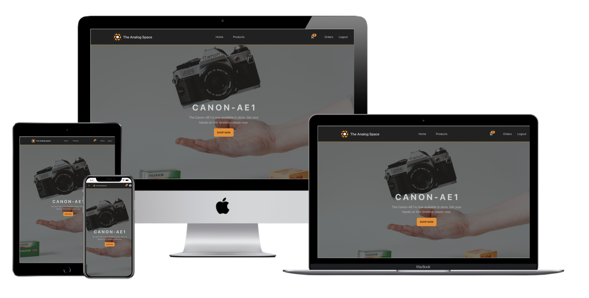
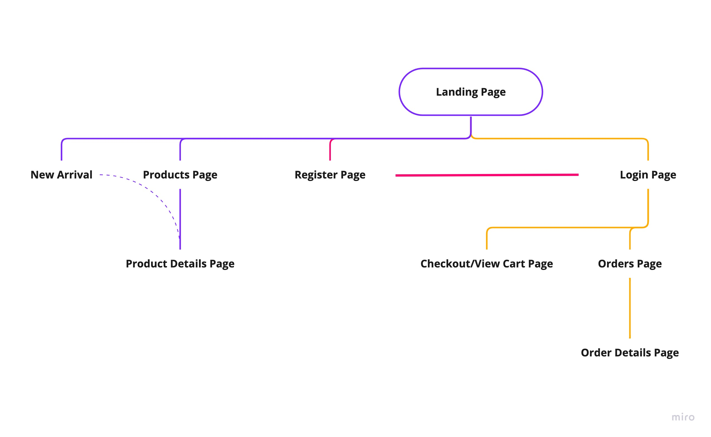
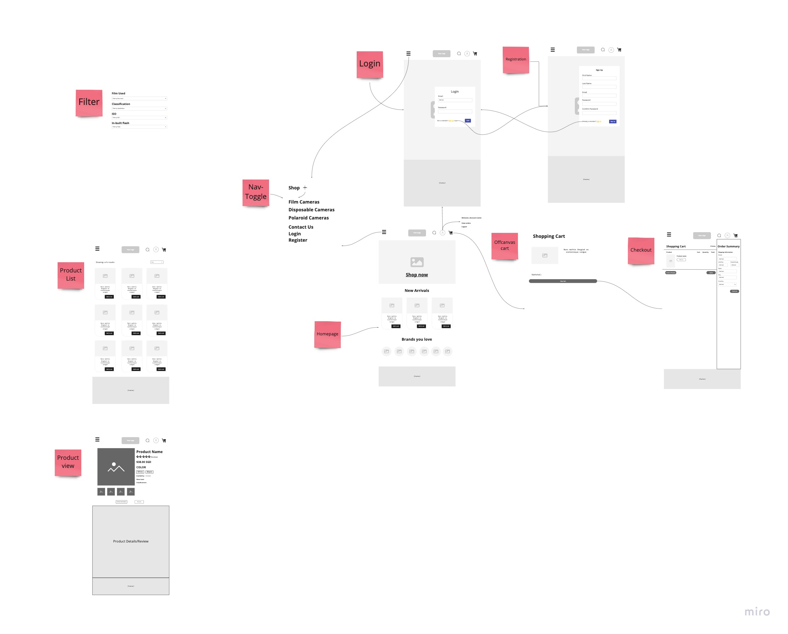

# All-About-Swords

 

## Project Summary

**Project Context**

`The Analog Space` is an e-commerce website mockup that sells film cameras. This project uses React.js as a front-end framework and a customised API retrieved from it's backend framework, link to the repository [here](https://github.com/happygoalvin/The-Analog-Space-Express).

**Site Owner's Goals**

As the site owner, I want to entice consumers into using my website to purchase film cameras from me and allow them to have a pleasant and smooth shopping experience.

**User Goals**

The user goals are to shop for the latest film cameras and to eventually reach a purchase decision if there's a product that satisfies the users' needs.

**Live demo**

The Live Demo to the consumer site can be accessed [here](https://remarkable-treacle-3709a7.netlify.app/)

## UX/UI

### **Objective**

The UI objective is to create a striking application that is visually pleasing and easy to use to entice the user in browsing the website.

### **Strategy**

_Organisation_

- Objective: To provide a user friendly website for a pleasant online shopping experience.

_User_

- Objective: To source for a website that sells film cameras

- Needs: User would like to search and subsequently purchase from a wide category of film products.

- Demographics:

  - Film enthusiasts looking for their next film haul
  - Casual users looking to own a film camera to try out analog photography

- Pain Points: Unable to find enough film camera websites that sell at a cheaper price range or has the product that they are looking for.

### **User Stories**

| User Stories                                                                                                                                                                                                              | Acceptance Criteria(s)                                                                                                                                               |
| ------------------------------------------------------------------------------------------------------------------------------------------------------------------------------------------------------------------------- | -------------------------------------------------------------------------------------------------------------------------------------------------------------------- |
| As a person who is looking for film cameras, I would like to search for a broad range of film cameras and if possible, at a cheaper price range                                                                           | Include a broad type of film cameras that the user can purchase, and allow them to filter by the types of product                                                    |
| As a casual user searching for a film camera for a purchase, or for a friend/relatives birthday who's a beginner/professional. I'd want to be able to easily look for the appropriate cameras at the relative price range | Features that allow the user to filter through the product types and classifications, min cost and max cost to allow them sift through what the user is looking for. |

### **Scope**

_Functional Specifications_

1. User will be able to filter for products through its type, manufacturer, classification, films, name and min cost or max cost.

2. User will be able to add a specific product to cart, update its quantity and remove a specific product from cart

3. User will be able to checkout and view their summarised order history and order details.

4. User will be able to register an account, and login.

5. User will be able to add to cart, checkout and view orders when they have logged in.

6. Have a landing page with a call to action and display new arrivals for user to view.

_Content Requirements_

1. Information regarding film cameras has to be populated within the admin database.

_Non-functional Requirements_

- Mobile Responsiveness
  - Achieved via use of grid and flexboxes, with appropriate paddings and margins.
- Performance

### **Structure**

 

### **Skeleton**

 

## **Layer**

### Collapsible Tab

- Collapsible dropdowns on the navbar allows user to navigate easier on mobile responsive mode.

- Toggleble filters on product page allows for user to filter products.

## **Colors**

- Shades of black, orange, purple and cyan were used.
- Black and orange were used as primary colors, purple was used as a secondary color and cyan is used as an accent color.
- The colors used helps to create a futuristic kind of look with some reference to the old kodak brand colors, associating the website with the old film cameras branding.
- Black and white colors were used to create contrast to the shades of brown for readable texts.

### _Color palettes used_

 

## **Typography**

- tailwind's prose and font mono typography was used in the website to create that modern and futuristic look and feel.
- Font size is adjusted for readability
- Font weights are used appropriately for its body,sub-headers and headers.

## **Test Cases**

| Category                    | Input / Actions              | Output / Errors                                                                                                                                                                                                                                                              |
| :-------------------------- | :--------------------------- | :--------------------------------------------------------------------------------------------------------------------------------------------------------------------------------------------------------------------------------------------------------------------------- |
| Overall                     | Mobile Responsive            | No error                                                                                                                                                                                                                                                                     |
| Nav Bar                     | Mobile Responsive            | No error                                                                                                                                                                                                                                                                     |
| Nav Bar Links               | On Load / Click              | Takes me to the correct pages as intended, no error.                                                                                                                                                                                                                         |
| Navbar collapse             | Mobile Responsive / On Click | Navbar collapsible buttons work as intended.                                                                                                                                                                                                                                 |
| Sword Catalogue             | Mobile Responsive            | No errors, upon hitting < 992px width filter options will become a row of columns to search. And cards will be displayed in a linear manner                                                                                                                                  |
| Product Context            | On Load                      | Gets all products on load as intended.                                                                                                                                                                  |
| Filter Options              | On Click                     | Filter functions works as intended in products page, no error. |
| User Context    | On Load                      | Successfully retrieves user information as intended when logged-in. There's an existing issue with logout not being able to work when the access token and refresh token has been erased from local storage and state before axios posts to the backend.                                                                                                                                                                                              |
| Add to cart                 | On Click                     | Will successfully add product to cart if logged in and take user to login page if user is logged in.                                                                                                                                                          |
| Remove from cart      | On Click                     | Will remove specific product from cart as intended.                                                    |
| View Cart/View details      | On Click                     | Will send user to checkout page and products details page respectively. Works as intended.                                                                                                                                                                              |
| Update quantity | On Click                     | Updating quantity in checkout Page updates the quantity in the backend, works as intended.            |
| Checkout | On Click                     | Will redirect user to stripe's payment page. Works as intended                                                                                                                                           |
| Orders Page                      | On Click                     |  Showcases the order history of the user                                                                                                                                                                                                       
Order Details Page | On Click | Displays order information and items purchased|
Order Context | On Load | Loads all order data for user as intended 
Cart Context | On Load | Loads all cart data for user as intended

## Technologies Used

- HTML5

  - Creating import CDN for Bootstrap and fontawesome

- CSS3

  - Styling various elements in the web app

- Javascript

  - To set conditions and interactive elements in the web app

- [ReactJS](https://reactjs.org/)

  - To create a single page application by manipulating state variables

- [Tailwind CSS](https://tailwindcss.com/docs/installation)

  - Tailwinds utility CSS classes and typography were used for this project

- [Daisy UI](https://daisyui.com/)

  - For the navbar, footer, drawers in products, hero container, carousel, cards and tables and halloween themed color set.

- [GitHub](https://github.com/)

  - For creation of respositories and storing source code

- [Netlify](https://www.netlify.com/)

  - For deployment of React Application

- [Multi Device Website Mockup Generator](https://techsini.com/multi-mockup/index.php)

  - To display mobile-responsiveness of web app across different devices

- [Axios](https://github.com/axios/axios)

  - To call GET,POST,PUT and DELETE from the API endpoints.

- [React-Loader-Spinner](https://mhnpd.github.io/react-loader-spinner/)

  - Used for loading page

- [Simple-Notify](https://github.com/simple-notify/simple-notify)

  - Used for toast messages

## Credits

### **images**

[FreeLogoDesign](https://www.freelogodesign.org/)

- Brand logo created using FreeLogoDesign

[Hero-image](https://unsplash.com/photos/odbndb-HFi4)

- hero image from unsplash credits to Hello I'm Nik

[login-bg](https://unsplash.com/photos/VD9aXPQbbao)

- login background from unsplash credits to Moriah Wolfe

[register-bg](https://unsplash.com/photos/SaPpu9xWvlQ)

- Register background from unsplash credits to Mark Neal

### **Icons**

[Font Awesome](https://fontawesome.com/) For various icons used in this web app.
[SVG Repo](https://www.svgrepo.com/) For SVG icons used in this web app.
